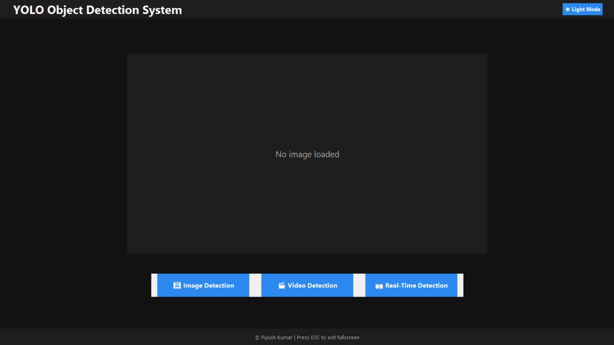
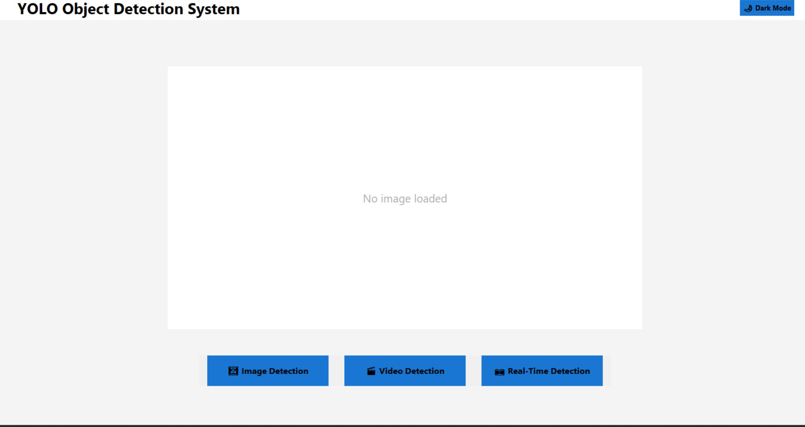
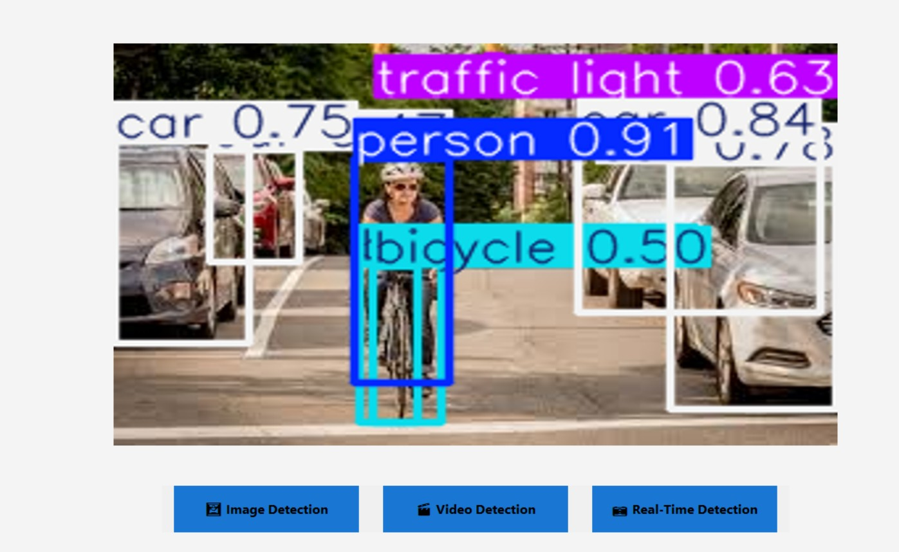
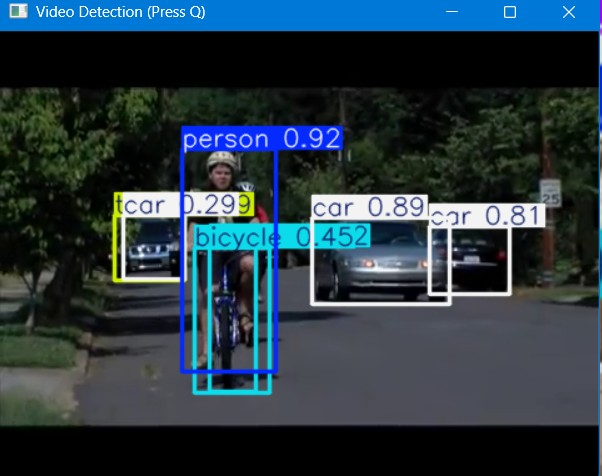
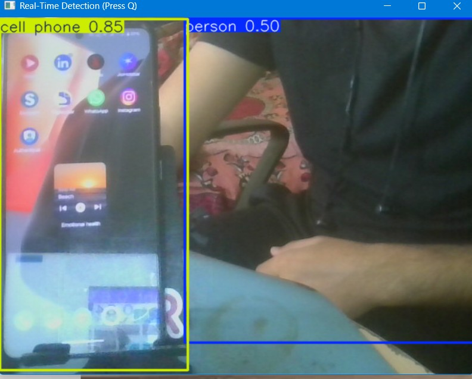

# 🧠 YOLO Object Detection GUI  
### Real-Time Image, Video & Webcam Object Detection  
**Developed by Piyush Kumar**

---

## 🚀 Project Overview

**YOLO Object Detection GUI** is a **desktop-based computer vision application** built using **YOLOv8** and **Python Tkinter**.  
It provides a clean, full-screen graphical interface for performing **real-time object detection** on:

- 🖼 Images  
- 🎬 Videos  
- 📷 Live Webcam Feed  

The application is designed to be **easy to use**, **visually clean**, and **practical**, making it suitable for demos, learning, and real-world experimentation.

---

## ✨ Key Features

- YOLOv8 Nano (`yolov8n.pt`) for fast inference
- Full-screen desktop GUI
- Dark Mode / Light Mode toggle
- Image detection inside the GUI window
- Video & webcam detection using OpenCV
- Threaded inference (GUI never freezes)
- Keyboard shortcuts for smooth exit
- Clean project structure & documentation

---

## 🛠 Tech Stack

- **Python**
- **YOLOv8 (Ultralytics)**
- **OpenCV**
- **Tkinter**
- **Pillow**
- **PyTorch**

---

## 📸 Screenshots

> 📌 *Screenshots taken on Windows 11. UI may vary slightly based on screen resolution.*

### 🖥 Main Dashboard (Dark Mode)

- Full-screen Tkinter interface  
- Dark mode enabled by default  
- Clean and minimal layout  

---

### 🌗 Light Mode Interface

- One-click toggle between Dark and Light mode  
- High-contrast and readable UI  

---

### 🖼 Image Object Detection

- Object detection on static images  
- Bounding boxes and labels drawn using YOLOv8  

---

### 🎬 Video Object Detection

- Real-time object detection on video files  
- Frame-by-frame inference using OpenCV  

---

### 📷 Real-Time Webcam Detection

- Live object detection using system webcam  
- Press **Q** to exit camera mode  

---

## 🖥 System Requirements

### Minimum
- Windows 10 / 11 (64-bit)
- 8 GB RAM
- Intel i5 / AMD Ryzen 5
- Webcam (built-in or external)

### Recommended
- 16 GB RAM
- NVIDIA GPU (for faster real-time detection)

> ⚠️ The application works on CPU as well, but webcam detection may be slower.
